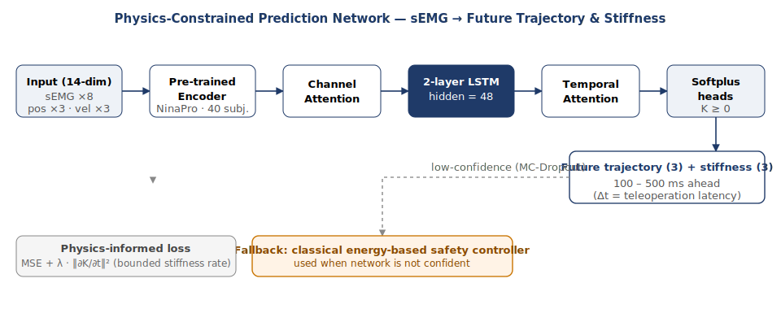

# Predicting What the Operator Means: A Design Sketch for Physics-Constrained Tele-Impedance Delay Compensation

*Self-directed study — written while preparing thesis applications, 2026.*

> This is a research proposal I have been sketching on my own while applying
> for thesis topics in this area. It is **not** an ongoing project — there is
> no trained model yet. I worked it through end-to-end as a way of
> stress-testing my own understanding before submitting applications that ask
> exactly this kind of question.

In teleoperation, communication delays of 50–200 ms are unavoidable, and they
make the remote robot react late to the operator's intent. The question I
keep coming back to: **can deep learning predict the operator's future
trajectory and joint stiffness from their surface EMG, far enough in advance
to mask that delay — without breaking safety guarantees?**

The answer, as I have read into the literature, looks like a layered system
rather than a single black box. Surface EMG already leads force output by
30–80 ms (well documented in the sEMG-force literature), and energy-observer
safety nets from the teleoperation literature catch the worst case. What
seems to be missing is the middle layer: a learned model that explicitly
predicts intent 100–500 ms into the future, slotted in between the natural
sEMG lead and the safety controller.

**Architecture I sketched.** A pre-trained encoder (NinaPro, 40 subjects)
consumes 8-channel sEMG plus position and velocity (14-dim input). Channel
attention reweights the muscle channels; a 2-layer LSTM (hidden = 48) tracks
dynamics; temporal attention summarises the recent window; softplus heads
produce the next trajectory and a positive-definite stiffness vector. A
physics-informed loss penalises the rate-of-change of stiffness, so the model
can't cheat by predicting wild swings.

**Ablation plan.** Before fixing the architecture, the right move is a
systematic comparison of five sequence models — Linear, 1D-CNN, GRU, LSTM,
TCN — and then ablations over hidden size, depth, attention placement, and
input modality (raw vs. filtered sEMG, with vs. without position and
velocity). Pre-training would be followed by leave-one-subject-out
fine-tuning so that any cross-user numbers stay honest.

**Trust the model, but verify.** Uncertainty would be estimated with
MC-Dropout. When confidence drops, the system falls back to a classical
energy-based safety controller — the learned prediction is only used when it
has earned it.

What I like about this problem is the cleanliness of the separation: physics
provides a hard prior (positive stiffness, bounded rate-of-change), a
classical controller provides a safety floor, and deep learning fills a
well-defined gap (a multi-step-ahead horizon that adaptive filters can't
reach). The point isn't "deep learning everywhere" — it is deciding precisely
*where* in the loop a learned component earns its place. That kind of
decision-making, more than any single architecture, is what I want to keep
working on.
