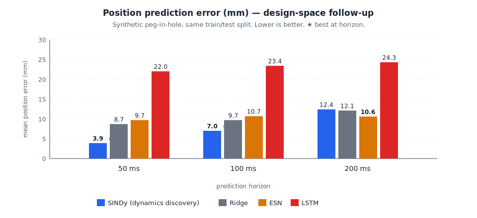

# Toward Multimodal Predictive Systems for Action-Time Prediction

*Self-directed reflection — building on the tele-impedance study, 2026.*

The SINDy follow-up on the sEMG impedance design-space study (see
*Discovering equations vs fitting them* on this site, or
`results_sindy.md` in the repository) left me with a sharper version of
a question I had only been gesturing at before. The follow-up replaced
LSTM-with-architectural-priors as the protagonist with **SINDy used as
a dynamics learner** — learn `d(state)/dt = f(state, sEMG)` from data,
keep only sparse terms via Lasso, integrate forward to the target
horizon. On the same synthetic peg-in-hole data, SINDy gave 3.9 mm at
50 ms and 7.0 mm at 100 ms — roughly twice as good as the next method —
while LSTM, with ~32 k parameters against ~3 k samples, finished last
across the board.

The numbers matter, but what stuck with me is the **artefact**. SINDy
keeps 1 nonzero term in `dx/dt`, 5 in `dy/dt`, 3 in `dz/dt`. The full
prediction model fits on one page; each equation is a sparse polynomial
a human can read, falsify, and retrain in seconds. When the prediction
is wrong at 200 ms, you can look at the equation and tell where the
assumption broke. That is a qualitatively different research object
from the hidden state of a recurrent network.

This is what reframes the original "safety fallback" problem for me.
The earlier instinct was that even a low-error learned model has to
defer to a classical, energy-based safety controller as a backup,
because no one knows how to be accountable for what a black box would
do in a situation no one has thought through. Causality as a fix —
encoding what the model is "allowed" to infer — felt structurally
wrong; the world is too rich to specify edge case by edge case. But
the SINDy result points to a third path: don't bolt an interpretability
layer onto a black-box prediction, don't try to constrain it from the
outside — make the **prediction object itself** something you can
inspect.

The direction that pulls me — and I want to be upfront, it is an area
I am only beginning to read into — is **multimodal predictive systems**
in which the model's belief about the future is itself a physically
grounded, observable, checkable artefact. Sparse-polynomial discovery
from sensor data is one minimal example: a 200-ms prediction is a few
lines of algebra you can step through. Learned physical simulators are
another: a predicted half-second unfolds in 3D and you watch it. They
share the property that *"is this prediction safe to act on?"* can be
answered by inspecting the prediction itself, not by adding an external
filter beside it.

That reframing changes the problem from "make the AI prediction more
interpretable" to "make the AI's *future* the thing we inspect". I do
not pretend to know which architectural family — diffusion priors,
video transformers, learned simulators, neural physics — does this
best, or whether the framing survives contact with real human sEMG,
which has cross-talk, fatigue drift, and motion artifacts the simulator
does not produce. The next phase is to find out. That is exactly why
it is the direction I want to spend it on.
